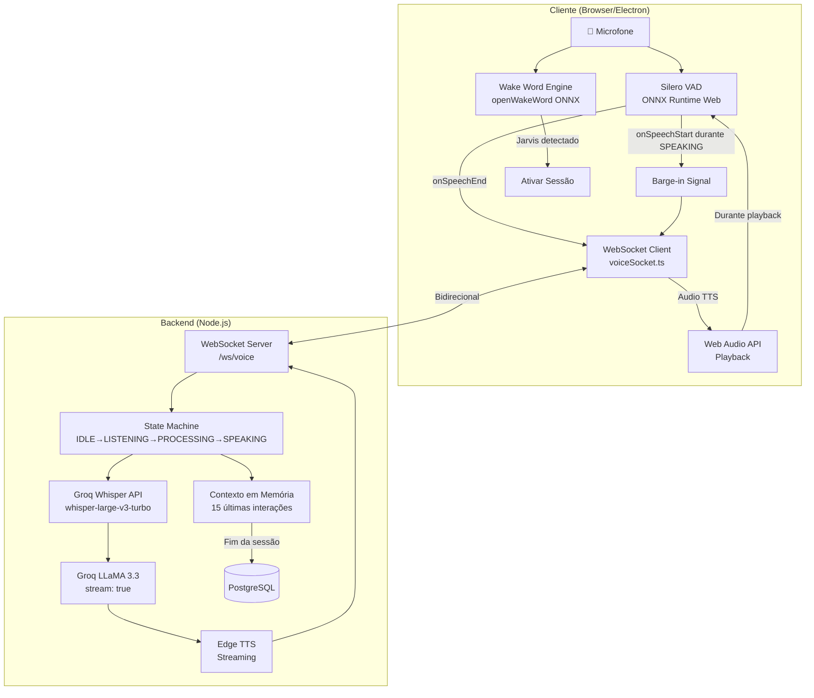

# Blueprint: Voice-First & Continuous Conversation

## Objetivo
Transformar a interface do Jarvis em um sistema full-duplex de baixa latência, permitindo conversação contínua via VAD, interrupção de fala (barge-in) e ativação passiva por Wake Word local.

## Arquitetura



## Estado da Sessão

```
IDLE ──(mic click/wake word)──► LISTENING ──(onSpeechEnd)──► PROCESSING ──(LLM+TTS)──► SPEAKING
  ▲                                ▲                                                      │
  │                                └─────────────────(TTS finalizado)──────────────────────┘
  │                                ▲
  │                                └─────────────────(barge-in interrupt)──────────────────┘
  └──(desconexão/timeout)──────────┘
```

## Tarefas de Arquitetura e Código

### Epic 1: Infraestrutura de Conexão (Backend)
- [ ] Criar servidor **WebSocket** no path `/ws/voice` para streaming bidirecional de áudio
- [ ] Implementar máquina de estados por sessão: `IDLE` → `LISTENING` → `PROCESSING` → `SPEAKING`
- [ ] Configurar buffer de contexto em memória (Map por session ID, últimas 15 interações)
- [ ] Integrar Groq Whisper API para STT server-side
- [ ] Integrar Edge TTS streaming para resposta de áudio via WebSocket

### Epic 2: Engine de Detecção de Voz (Frontend)
- [ ] Integrar **Silero VAD** via `@ricky0123/vad-web` (ONNX runtime)
- [ ] Configurar eventos `onSpeechStart` (buffer de gravação) e `onSpeechEnd` (empacota WAV, envia via WS)
- [ ] Criar módulo `voiceSocket.ts` para gerenciar conexão WebSocket de voz
- [ ] Refatorar `JarvisAssistant.tsx` para usar VAD + WebSocket no lugar do Web Speech API

### Epic 3: Sistema de Interrupção (Barge-in)
- [ ] Manter VAD ativo durante playback de áudio da IA
- [ ] Se `onSpeechStart` durante estado `SPEAKING`:
  - Frontend para o áudio imediatamente
  - Envia `{ action: "interrupt" }` via socket
  - Backend cancela Groq + TTS, salva resposta parcial

### Epic 4: Detecção Local de Wake Word (Always-On)
- [ ] Integrar **openWakeWord** (ONNX, browser-compatible, open-source)
- [ ] Carregar modelo para palavra "Jarvis"
- [ ] Vincular detecção à mesma função do botão "Iniciar Conversa"
- [ ] Indicador visual de estado (pulsing dot)

### Epic 5: Refinamento de Integração (LLM & Contexto)
- [ ] Groq com `stream: true` para resposta progressiva
- [ ] TTS chunked: gerar áudio por sentença conforme texto chega do LLM
- [ ] Priorizar janela de conversa recente sobre RAG para contexto imediato
- [ ] Salvar resumo da sessão no PostgreSQL ao fechar conexão

## Dependências NPM

| Pacote | Propósito | Tamanho |
|--------|-----------|---------|
| `@ricky0123/vad-web` | Silero VAD frontend (ONNX) | ~2MB |
| `onnxruntime-web` | Runtime ONNX para browser | ~8MB |
| `uuid` | Geração de session IDs | <50KB |
